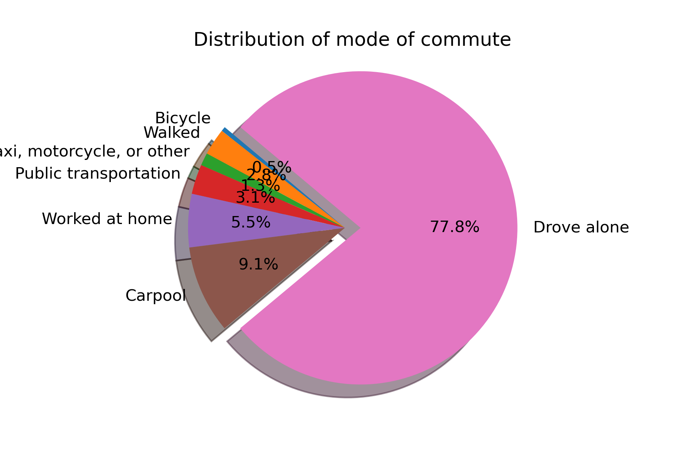
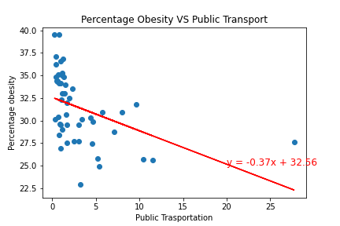
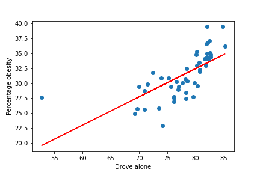
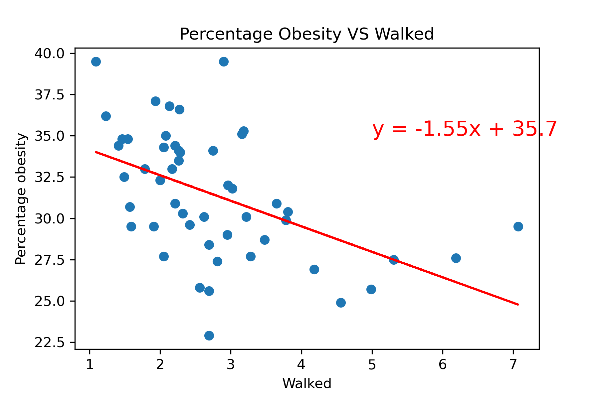
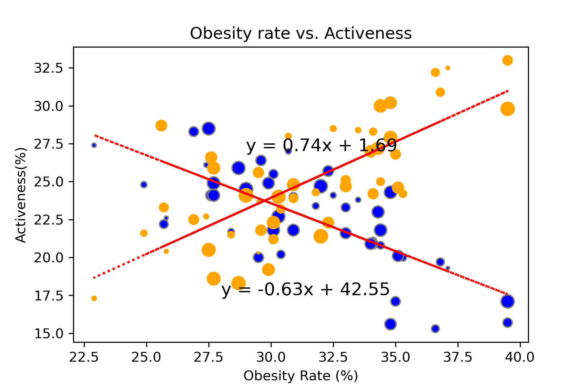
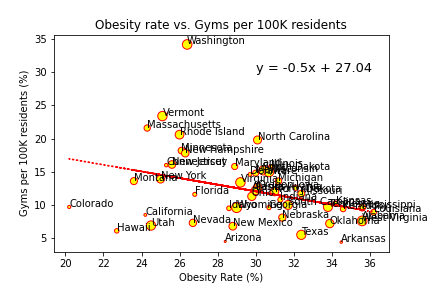

# Obesity, Obesity and Obesity - Tackling Obesity in 'Merica 

 

Human’s obsession with health is nothing new. One unhealthy trend is on the rise and has been increasing every year, just by itself it has had a significant economic impact on the United States Health care system <a href="https://www.cdc.gov/obesity/adult/causes.html">[1]<a/> which amounts to an estimated US$147 billion, in Australian dollars, that’s approximately 6.3 billion <a href="https://www.cheesecake.com.au/our-cakes/everyday-delights/pavlova-dressed">Pavlovas<a/> from the Cheesecake shop. The issue is none other than Obesity. 

## Contributors:

<table>
  <tr>
    <td align="center"><a href="https://github.com/AminSundrani"> <b>Amin Ali</b></a></td>
    <td align="center"><a href="https://github.com/foofx88"> <b>FangXuan Foo</b></a> </td>
    <td align="center"><a href="https://github.com/knarisara"> <b>Narisara Kantanon</b></a> </td>
    <td align="center"><a href="https://github.com/rajeshnair1984"> <b>Rajesh Nair</b></a> </td> 
  </tr>
  <tr><td align="left">Contributions:</td>
  <td colspan="3">Everyone - Data Wrangling and Data Cleaning, presentation</td></tr> 

<td align="left"> <! --Amin Ali's contributions -->
      <ul align="left"> 
      <li>Fast Food Questions</li>
      </ul></td>
<td align="left"> <! --FX Foo's contributions -->     
      <ul align="left">
      <li>Physical Activeness Question</li> 
      <li>Polishing readme.md file</li>
      </ul></td>
<td align="center"> <! --Narisara's contributions -->      
      <ul align="left">
      <li>Age Group Question</li>
      </ul></td>
 <td align="center"> <! --Rajesh's contributions -->    
      <ul align="left">
      <li>Walkability Questions</li>
      </ul></td>
  </tr>
<table />

## Project Introduction
What classifies someone as Obese? It is when an individual with a Body Mass Index (BMI) of over 30.  <a href="https://www.nhs.uk/conditions/obesity/diagnosis/">[2]<a/> The issue is complex, resulting from a combination of causes and individual factors such as behavior and genetics. In this project, we have gathered data from various sources to identify the strength of the relationship between obesity and it’s contributing factors. Hence, we have chosen to research on fast food restaurants availability, public transport availability, physical activeness, and general public’s age group in the 50 states of United States of America.
  
## Scope
<ul>
<li>Dataset Time to be 2019</li>
<li>All analysis and data to contain data of all the 50 states in USA, not including Federal District (District of Columbia) and Territories (American Samoa, Guam, Northern Mariana Islands, Puerto Rico, US Virgin Islands) </li>
<li>Average of Walkable distance - Public transport (Get total for each state) </li>
<li>Fast food -Include all restaurants in Number of restaurants per state (Heat Map number of Restaurant vs Obesity)   
Top 5 Fast-food restaurants according to <a href="https://www.eatthis.com/most-popular-fast-food-chains/">Eatthis</a>- McDonald's, Starbucks, Chick-fil-A, Taco Bell, Burger King  
Count restaurants for each states, use the dot size as the heat map. </li>
<li>Age group - Children and Teens (Ages 2 - 19 years) Adults - 20 Over</li> 
<li>Physical activity facilities to focus on Gyms, Physical activeness (Meeting CDC requirements -Achieving at least 150 minutes a week of moderate-intensity aerobic physical activity or 75 minutes a week of vigorous-intensity aerobic physical activity and engage in muscle-strengthening activities on 2 or more days a week) </li>
</ul>
  
## Research questions to answer:
1.	The more accessible the fast-food restaurant the higher the obesity rate
2.	The higher the population, the more the Fast food restaurants, hence higher the obesity rate
3.	Is there any relation between mode of commute and obesity?
4.	How many are walking for their day-to-day need?
5.	The higher rate of physical activeness, the lower the obesity rate
6.	The greater number of gyms in a state, the lower the obesity rate
7.	What population groups are most at risk to not meet physical exercises?
8.	Younger generation that tends to prefer fast food would be more obese
9.	Older generation that are more immobile tend to be more obese

## Analysis:

Question 3 : Is there any realtion mode of commute and besity?  
Question 4 : How many are walking for their day-to-day need?  

  
Pie Chart show the distribution of Mode of commute.  
87.9% of the population drive to work alone or used car pool.  
3.1% uses public transport for work.  
Distribution shows lack of confidence in public transport.Pie Chart show the distribution of Mode of commute.  

  
The correlation coefficient between Obesity and Public transport is -0.43  
y = -0.37x + 32.56  
In the above scatter plot,it is clearly visibly that there is a moderate negative correlation   
between the use if public transport and the obesity rate.

  
The correlation coefficient between obesity and Drove alone is 0.68  
y = 0.47x + -5.45  
In the above scatter plot,it is clearly visibly that there is a strong positive correlation   
between the use of personal vehicle and the obesity rate.

  
The correlation coefficient between obesity and Walked is -0.49  
y = -1.55x + 35.7  
In the above scatter plot,it is clearly visibly that there is a moderate negative correlation   
between the walking and the obesity rate. 

5.	The higher rate of physical activeness, the lower the obesity rate
6.	The greater number of gyms in a state, the lower the obesity rate

  
As one of the causes of Obesity defined by the CDC is due to physical inactivity, there is a strong (but not perfect) negative relationship between Obesity rate and physical activeness (R= -0.73) while a positive strong relationship between Obesity rate and physical inactivity (R = 0.73). This proves that the state residents that meets the CDC's physical activeness requirements have a lower obesity rate, hence proving the hypothesis.

The relationship between the Obesity Rate of a state and available Gyms per 100K state residents is a low negative (weak) correlation with the R-value of -0.34. This means despite having more gyms per 100K state residents, it has not much affect on the obesity rates in a state. An interesting observation that can support this is the data plot which has the highest % of gyms per 100K residents (Washington) still have a higher rate of Obesity compared to those with less gyms available (Colorado, Hawaii)
## Datasets used
-	https://open.cdc.gov/apis.html
-	https://cloud.google.com/maps-platform/?_ga=2.80353745.735577293.1618924935-1052635322.1618821265
-	https://data.world/health/childhood-obesity-in-theus/workspace/file?filename=obesity_child_age.csv
-	https://www.americashealthrankings.org/explore/annual/measure/obesity/state/ALL
- https://www.bts.gov/browse-statistical-products-and-data
